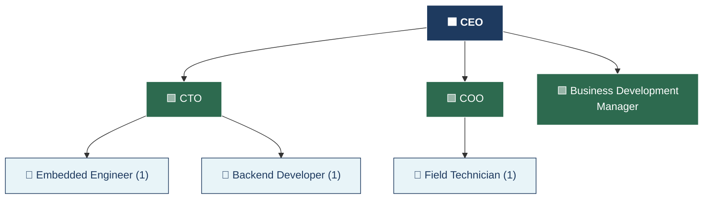
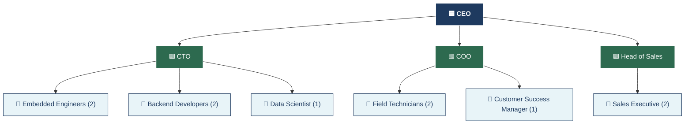
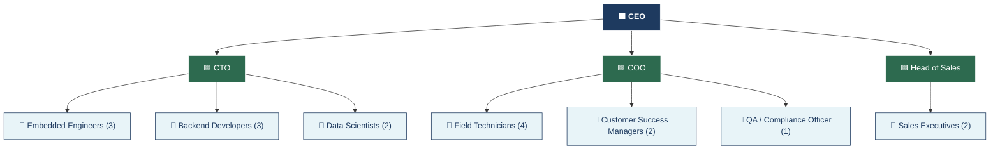

# Organizational Tree Charts

---

## Year 1 – Prototype & Pilot Phase

> **Total : 7 employés**

---

## Year 2 – Commercial Launch

> **Total : 13 employés**

---

## Year 3 – Scaling Phase

> **Total : 20 employés**
